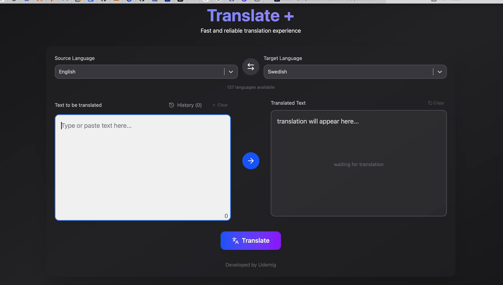

# 🌐 Redux Toolkit Translation App

A modern, responsive translation application built with React, Redux Toolkit, and Vite. Features real-time translation, language swapping, translation history, and a beautiful dark theme UI.

## ✨ Features

- 🔄 **Real-time Translation** - Instant translation using Deep Translate API
- 🌍 **100+ Languages** - Support for multiple languages with auto-detection
- 🔀 **Language Swapping** - Quick swap between source and target languages
- 📚 **Translation History** - Save and access your recent translations
- 📋 **Copy/Clear Functions** - Easy text management
- 🎨 **Modern UI** - Beautiful dark theme with smooth animations
- 📱 **Responsive Design** - Works perfectly on desktop and mobile
- ⚡ **Fast Performance** - Built with Vite for lightning-fast development

## 🛠️ Tech Stack

- **Frontend**: React 18 + Vite
- **State Management**: Redux Toolkit
- **Styling**: Tailwind CSS
- **Icons**: Lucide React
- **API**: Deep Translate API
- **HTTP Client**: Axios

## 🚀 Live Demo

_Screenshot showing the main interface with language selection, text input areas, and translation functionality_

![Translation App Demo]

